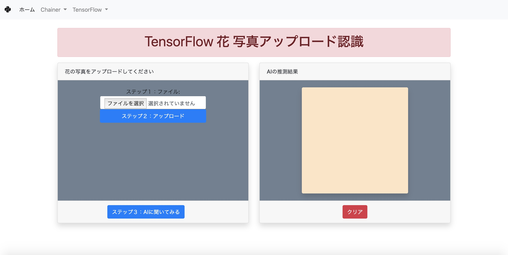

# ウェブアプリの説明

学習済のモデルを利用して画像分類（Classification）するデモ用のウェブアプリです。



（注意：学習する部分のプログラムが含まれていません。）

使用しているプログラミング言語はPythonです。

使用している深層学習（ディープラーニング）フレームワークは
* Chainer
* Keras
* TensorFlow

を使っています。

ウェブアプリケーションフレームワークはFlaskを使っています。


## プログラムを取得してください。

```bash
git clone url
```

## Dockerで起動させる

（Raspberry Pi以外、MacOS, Linux, Windowsの場合）

下記のコマンドを実行してください。

```bash
docker-compose up
```

## 直接起動させる

（特にRaspberry Piの場合、 python3を利用する場合）

* OpenCVをコンパイルしてインストールする必要があります。

下記のコマンドを実行してください。

```bash
cd app
python3 app.py
```

